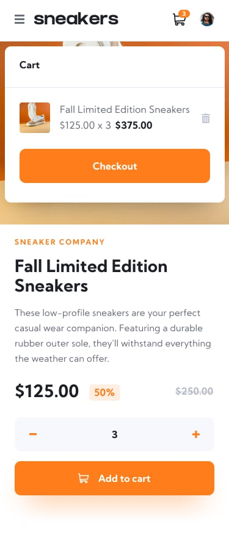

# Modern E-commerce Product Page - React.js Webpage - Frontend Mentor

This repo is a solution to the [E-commerce product page challenge on Frontend Mentor](https://www.frontendmentor.io/challenges/ecommerce-product-page-UPsZ9MJp6). Built with React.js and bundle with Vite, this Javascript built web page is fully responsive on various screen sizes and mainly implements the Context API, to store global state of the cart. The app has mainly been styled using Tailwind CSS framework.

Frontend Mentor challenges help you improve your coding skills by building realistic projects.

## Table of contents

- [Overview](#overview)
  - [The challenge](#the-challenge)
  - [Screenshots](#screenshots)
  - [Links](#links)
- [Build process](#build-process)
  - [Built with](#built-with)
  - [What I learned](#what-i-learned)
  - [Continued development](#continued-development)
  - [Useful resources](#useful-resources)
- [Author](#author)
- [Acknowledgments](#acknowlegments)
- [More Resources](#more-resources)

## Overview

### Getting Started

clone the repo to your machine and run:

```npm
npm run dev
```

or

```
yarn dev
```

### The challenge

User should be able to:

- View the optimal layout for the site depending on their device's screen size
- See hover states for all interactive elements on the page
- Open a lightbox gallery by clicking on the large product image
- Switch the large product image by clicking on the small thumbnail images
- Add items to the cart
- View the cart and remove the items from it

### Screenshots




### Links

- Solution URL: [GitHub Repo](https://github.com/Jaweki/modern-ecommerce-product-page)
- Live Site URL: [Deployed on Vercel](https://modern-ecommerce-product-page-4q7e5unh0-jaweki.vercel.app/)

## Build Process

### Built With

- Semantic HTML5 markup
- Flexbox
- Mobile-first workflow
- [Tailwind](https://tailwindcss.com/) CSS Framework
- [React](https://reactjs.org/) - JS library
- [Vite](https://vitejs.dev/) - app mobule bundler

### What I learned

For an e-commerce website, its important to have a global store accesible by various webpages on the client side. Two major technologies used in React development, are Context API and React Redux toolkit. For this Project we used Context API, as it is much light weight and needs less boilerplate code for setting it up. Also, the project was single paged, hence no need to use redux.

In this app Context API, was used to store the cart contents. However, some other common use of the global state by context API, in e-commerce websites, include: theme congifuration and user wallet status.

The context API, has a context provider, that wraps around the main file in the code; in this case: App.jsx see this in the [main.jsx](./src/main.jsx). This provides a global access to the state variables defined in the [app context](./src/lib/AppContext.jsx).

### Continued development

At the moment, the app is at a milestone of development; However, for future design implementations, this single pages e-commerce react app, could be made into a component and added into a Fullstack web app.

Ideas, of counter or exraborate thoughts on the projects are surely welcome, and can be sent via my [email](mailto:werukioni@gmail.com).

### Useful resources

- [Tailwind](https://tailwindcss.com/) CSS Framework
- [React](https://reactjs.org/) - JS library
- [Vite](https://vitejs.dev/) - app mobule bundler

## Author

- Website - [Jack Weru Kioni](https://portfolio.jaweki.com)
- Frontend Mentor - [@Jaweki](https://www.frontendmentor.io/profile/Jaweki)
- Twitter - [@JackKioni](https://www.twitter.com/JackKioni)
- LinkedIn - [Jack Weru Kioni](https://linkedin.com/in/jaweki-dekut)

## Acknowledgements

This project was done to completion with team efforts of [Jack Weru Kioni](https://linkedin.com/in/jaweki-dekut) and [Ben Hurst](https://linkedin.com/in/benhurst1)

Pair programming session was prepared by [Chingu](https://www.chingu.io/) a web developers forum, that helps in boost developer growth.
Chingu organizes weekly planned pair programming session which developer enroll on weekly basis, and Voyagers which developers join in teams to do a much complex tasks.
Chingu is free to Join and participate, and has some premium perks it offers, which are quite affordable. [see their website for more...](https://www.chingu.io/)

The challenge undertaken in this Repo project, was initially provided by [Frontend Mentor](https://www.frontendmentor.io). Frontend mentor provides chllenges at different developer levels from junior to intermidiate to advanced; and of course, there is free and premium versions of the challenges, with premium versions offering figma sketches. For free versions only design templates are given as snapshots.

## More Resources

### React + Vite

This template provides a minimal setup to get React working in Vite with HMR and some ESLint rules.

Currently, two official plugins are available:

- [@vitejs/plugin-react](https://github.com/vitejs/vite-plugin-react/blob/main/packages/plugin-react/README.md) uses [Babel](https://babeljs.io/) for Fast Refresh
- [@vitejs/plugin-react-swc](https://github.com/vitejs/vite-plugin-react-swc) uses [SWC](https://swc.rs/) for Fast Refresh
